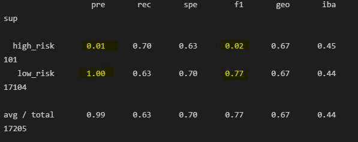
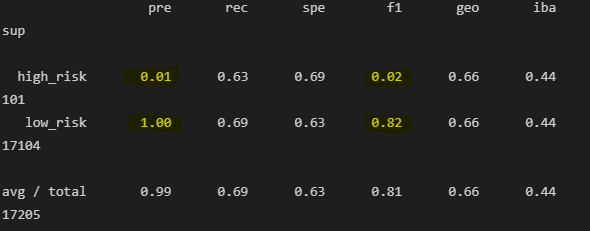
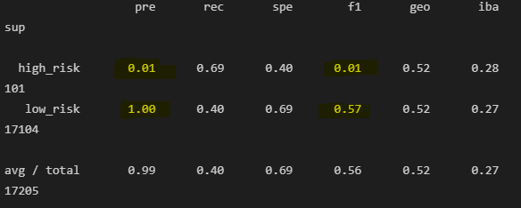
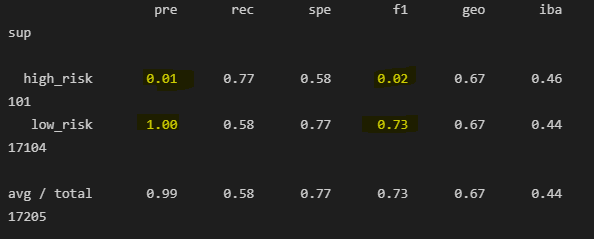
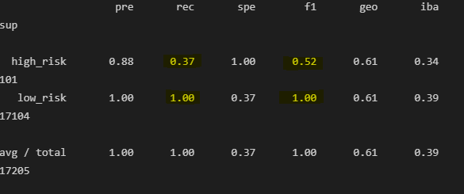
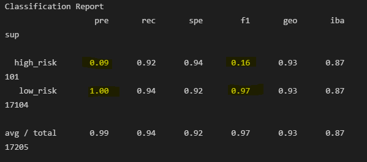

# Credit Risk Analysis

## Overview
Credit risk is an inherently unbalanced classification problem, as good loans easily outnumber risky loans. Therefore, different techniques will need to be used to train and evaluate models with unbalanced classes.  This project will explore six different Machine Learning models to predict credit risk:

- `RandomOverSampler`
- `SMOTE`
- `ClusterCentroids`
- `SMOTEENN`
- `BalancedRandomForestClassifier`
- `EasyEnsembleClassifier`

## Resources
- Data source: LoanStats_2019Q1.csv
- Software: Python 3.8.8, Jupyter notebook 6.4.0, Jupyter lab 3.0.16
- `imbalanced-learn` library
- `scikit-learn` library
- 
    Data Sources: OpenWeather API Key, Google API Key
    Software: Python 3.8.8, Jupyter notebook 6.4.0, Jupyter lab 3.0.16
    Python libraries: numpy, pandas, matplotlib, gmaps, citipy

## Results 
*Precision and recall are given for high-risk outcome.

| ML Model                        | Balanced Accuracy Score | Precision | Sensitivity (Recall) |
| ------------------------------- | ----------------------- |-----------| -------------------- |          
| `RandomOverSampler`             | 0.666323                | 0.01      | 0.70                 |
| `SMOTE`                         | 0.662306                | 0.01      | 0.63                 |
| `ClusterCentroids`              | 0.544733                | 0.01      | 0.69                 |
| `SMOTEENN`                      | 0.676041                | 0.07      | 0.77                 |
| `BalancedRandomForestClassifier`| 0.995989                | 0.88      | 0.37                 |
| `EasyEnsembleClassifier`        | 0.942400                | 0.09      | 0.92                 |

### Over & Under Sampling
In each of the four algorithms that employ resampling,  precision for detecting low risk loan applicants was at or nearly 1.00, while the precision for detecting high-risk loan applicants was 0.01.  This is to be expected because of the severely unbalanced data (good loans severly outnumber bad loans).  Precision is the measure of how reliable a positive classification is, so these tests are all very reliable at predicting low risk applicants, and spectacularly bad at predicting high risk applicants.  The highest sensetivity of these four tests was the SMOTEENN test at detecting high-risk applications (77%).  While this is good, a high recall, paired with low precision for high-risk loans will lead a bank to decline a lot of good loan candidates. 

#### `RandomOverSampler`

#### `SMOTE`

#### `ClusterCentroids`

#### `SMOTEENN`

### Ensemble Algorithms
The last two Machine Learning algorithms tested were Balanced Random Forest and Easy Ensemble.  Each of these two methods produced significantly better accuracy scores than the resampling techniques. The Random Forest algorithm had a precision of 88% for high-risk applicants and 100% for low-risk applicants.  This is a significant improvement from any of the resampling methods.  The recall (sensetivity) for high-risk applicants was low, however, at only 0.37, which is indicative of a large number of false negatives.

The easy ensemble algorithm had a very good recall (sensetivity) for both high and low risk applicants, at 0.94 and 0.97 respectively.  If we look at the confusion matrix, the algorithm predicted 1,076 applicants to be high-risk, and only 93 of them were actually high-risk.  On the other hand, 16,129 were predicted to be low-risk, and only 8 were actually high-risk.

#### `BalancedRandomForestClassifier`

#### `EasyEnsembleClassifier`

## Summary
The two algorithms that used ensemble methods were more accurate by almost every measure than the resampling methods for this data.  The Balanced Random Forest had a higher accuracy score than the Easy Ensemble, but the recall was much lower.  Depending on the bank's level of risk-aversion, I would recommend one of these last two models.

If the bank is relatively risk-averse, and is willing to deny some good candidates loans to avoid as many high-risk applicants as possible, then I would recommend the Random Forest Classifier.  The precision is high for high-risk applicants, which means there are very few false positives (applicants flagged for high risk but are actually low-risk).  Therefore, the bank will catch as many applicants as possible.
